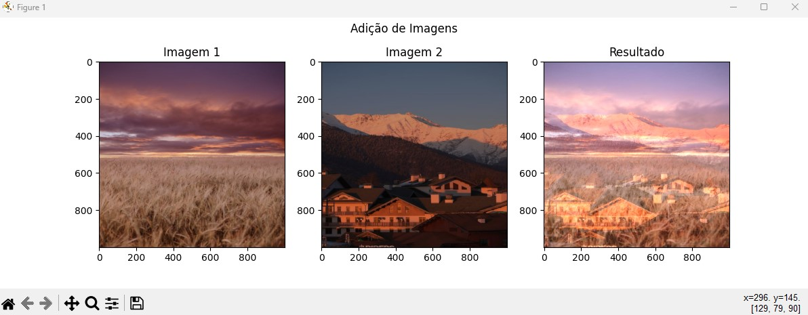
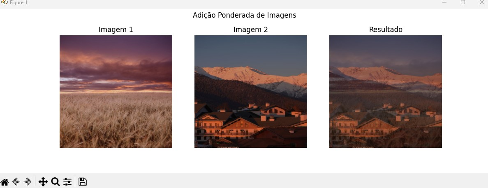
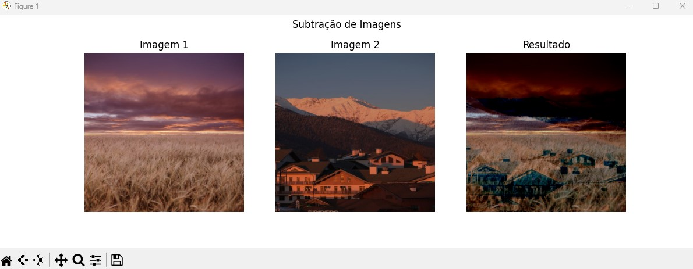

# Processamento de Imagens

Este repositório contém operações aritméticas para processamento de imagens, desenvolvidas como parte da disciplina de Processamento de Imagens da UTFPR-CP.
Utilizando Conda para o processamento e execução dos scripts desenvolvidos.

## Introdução

Neste repositório, você encontrará implementações em Python para diversas operações aritméticas em imagens. Essas operações incluem adição, adição ponderada, subtração e diferença absoluta. As operações podem ser aplicadas a imagens de sua escolha para obter resultados interessantes.

## Operações Aritméticas Disponíveis

### Adição (adction)
- Descrição: Esta operação realiza a adição de duas imagens.
- Arquivo: `adction.py`
- Resultado: 

### Adição Ponderada (adiction-weighted)
- Descrição: Esta operação realiza a adição ponderada de duas imagens.
- Arquivo: `adiction-weighted.py`
- Resultado:

### Subtração (subtraction)
- Descrição: Esta operação realiza a subtração de duas imagens.
- Arquivo: `subtraction.py`
- Resultado:

### Diferença Absoluta (absdiff)
- Descrição: Esta operação calcula a diferença absoluta entre duas imagens.
- Arquivo: `absdiff.py`
- Resultado:

---
*Nota: Certifique-se de ter o conda e miniconda configurado corretamente para executar esses scripts.*